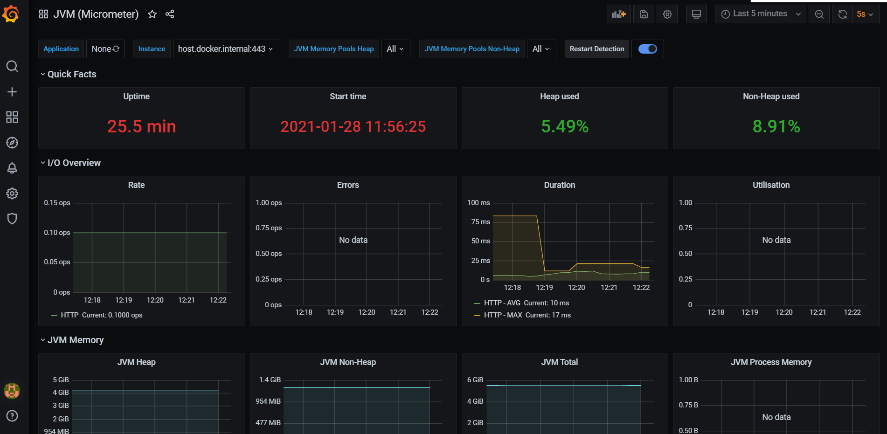

### MARVEL API
[](https://travis-ci.com/liliannss/marvel-api)

[](https://codecov.io/gh/liliannss/marvel-api)

### Versão
- V. 0.0.1 -> 13/01/2021
- V. 0.0.2 -> 27/01/2021

### Java Version
- 11
````json
    java -version
````

### Docker Version
- 20.10.2
````json
    docker -v
````

### Docker Compose Version
- 1.27.4, build 40524192
````json
    docker-compose --version
````

### Instruções local
- Baixar o código do repositório remoto
```json
  git clone https:github.com/liliannss/marvel-api.git
```
- Iniciar a classe GatewayApplication

### Swagger - [URL](http:localhost:8080/v1/public/swagger-ui.html)
### 

### Autenticação em Memória 
```json
    Nome de usuário: Stan Lee
    Senha: 123
```

### Testes Unitários
- Executar comando mvn para execução dos testes
```json
    mvn clean test
```

### Base de Dados em Memória - [URL](http:localhost:8080/v1/public/h2-console)
- #### Observação: necessário que a aplicação tenha sido inicializada através da classe Main
```json
Driver Class: org.h2.Driver
JDBC URL: jdbc:h2:mem:marvel-heroes
User Name: marvel
Password:
```

### Dockercompose
- Criar o arquivo .jar do projeto
```json
    mvn clean package
````
- Na pasta do projeto executar     
````json
    docker-compose up -d
````
- Em casos de alteração de código
```json
    docker-compose up --force-recreat
```

### Prometheus - [URL](http://localhost:9090/targets)


### Grafana - (Micrometer Dashboard - 4701) [URL](http://localhost:3000)
```json
    user: admin
    password: secure_pass
```
- Configurando Data Source Prometheus

